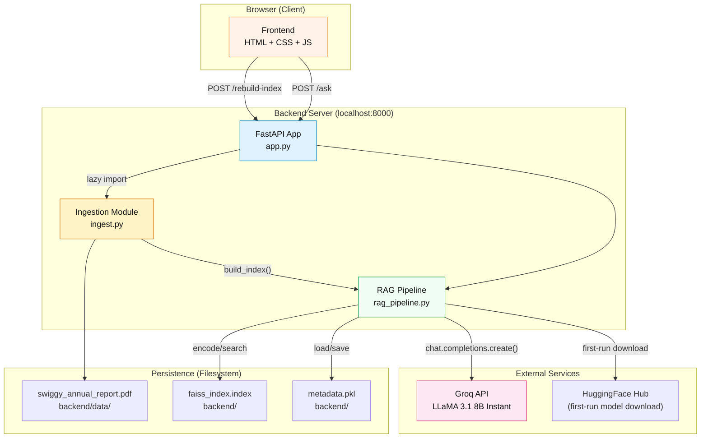
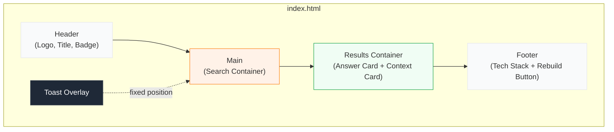
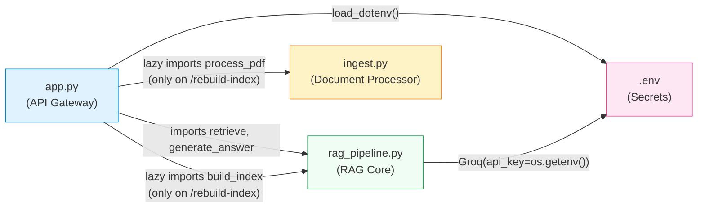
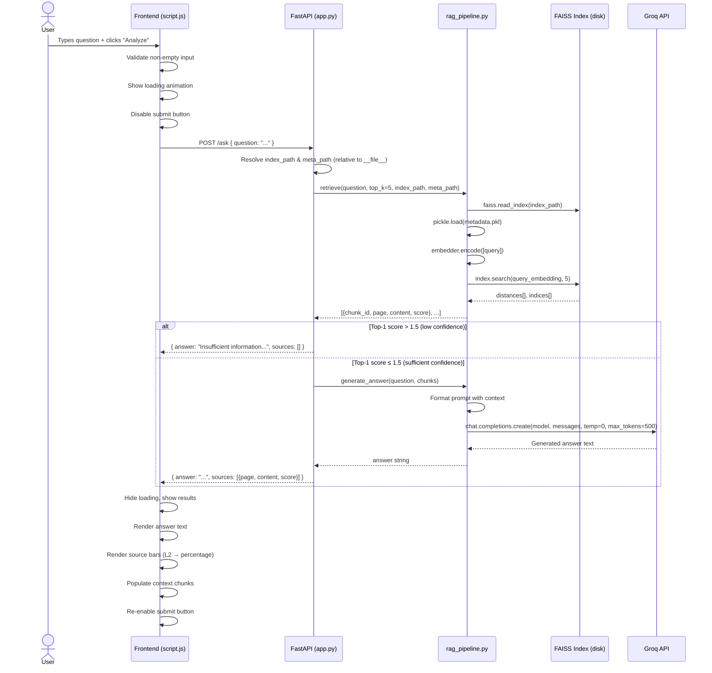
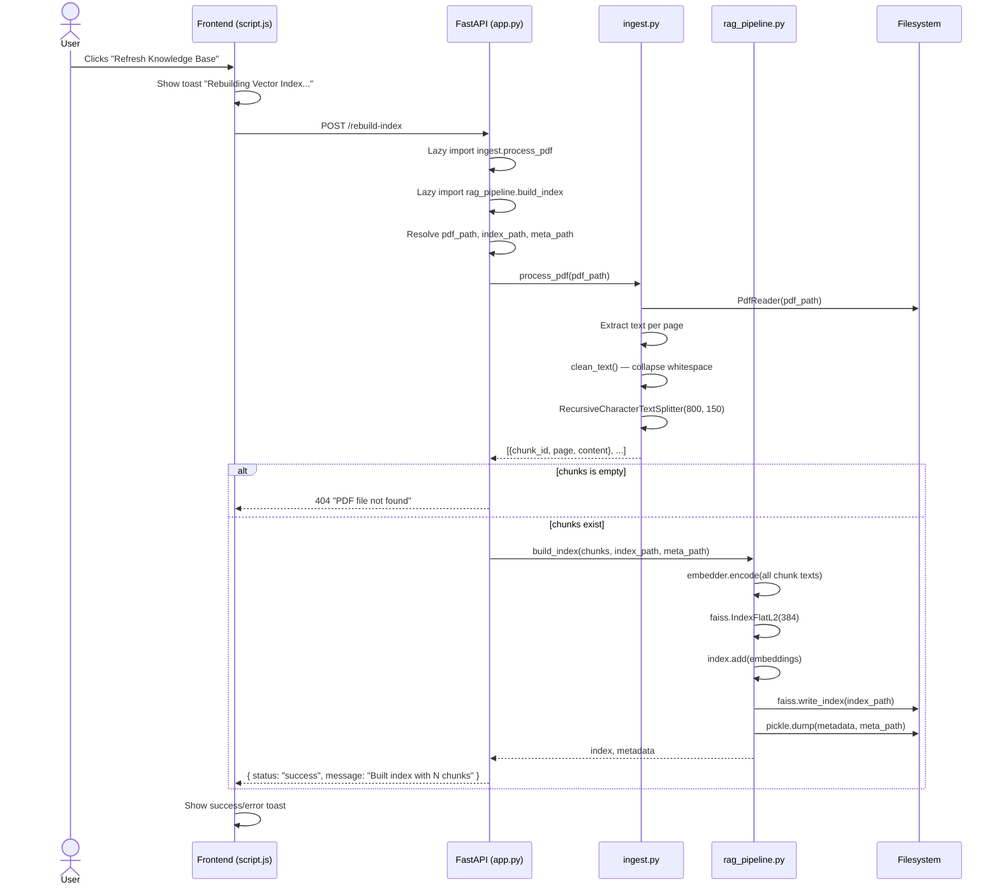
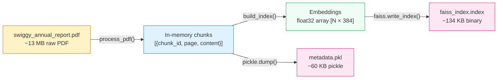
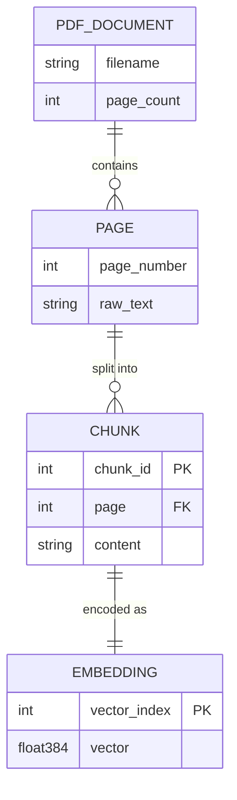
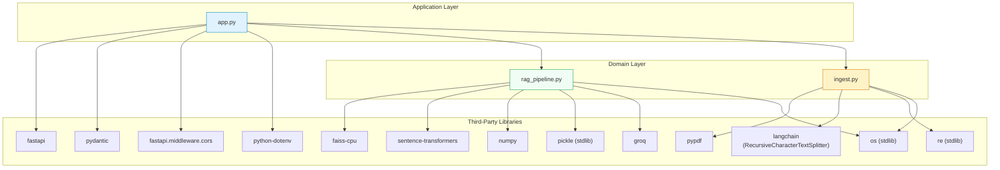
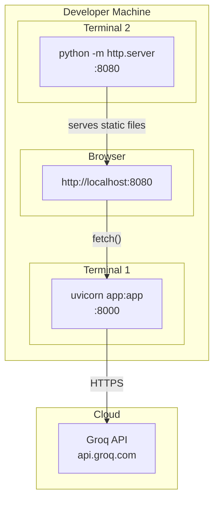

# SwiggyRAG — Architecture

## System Architecture Overview

SwiggyRAG follows a **two-tier client-server architecture** with no intermediary layers. The frontend is a static single-page application that communicates with a Python REST API over HTTP. All intelligence resides in the backend, which orchestrates document ingestion, vector search, and LLM generation.



---

## Frontend Architecture

### Technology

Vanilla HTML5 + CSS + JavaScript (ES6+). No framework, no build step, no bundler.

### Page Structure

The entire UI is a **single HTML page** (`index.html`) with three logical sections:



### UI Components (Implemented as DOM Sections)

| Component | DOM ID/Class | Purpose |
|---|---|---|
| Search Input | `#question-input` | Text input for user questions |
| Submit Button | `#submit-btn` | Triggers question submission |
| Quick Prompts | `.prompt-btn` (×5) | Pre-built suggested questions |
| Loading Indicator | `#loading` | Three-dot bounce animation + status text |
| Answer Card | `.answer-card` | Displays LLM-generated answer |
| Sources Summary | `#sources-summary` | Page numbers with color-coded relevance bars |
| Context Toggle | `#toggle-context` | Expand/collapse button for raw context |
| Context Content | `#context-content` | Raw text chunks from FAISS retrieval |
| Rebuild Button | `#rebuild-btn` | Triggers `/rebuild-index` |
| Toast | `#toast` | Transient notification messages |

### State Management

There is no application state beyond DOM visibility toggling. The frontend is **stateless** — each question submission is a fresh HTTP request. State is managed entirely through CSS class toggling:

- `.hidden` class (maps to `display: none !important`) controls visibility of loading, results, context, sources, and toast elements
- `.active` class on `#toggle-context` rotates the chevron icon

### Design System

The CSS uses a centralized custom property system in `:root`:

| Token | Value | Usage |
|---|---|---|
| `--primary-color` | `#fc8019` | Swiggy orange — buttons, accents, borders |
| `--primary-dark` | `#d6640c` | Hover states, header text |
| `--primary-light` | `#fff2e8` | Light orange backgrounds, focus rings |
| `--bg-gradient` | `linear-gradient(135deg, #f9fafb, #f3f4f6)` | Page background |
| `--surface-color` | `#ffffff` | Card backgrounds |
| `--border-color` | `#e5e7eb` | Dividers, input borders |
| `--success-color` | `#10b981` | High-relevance score bars |
| `--shadow-md` | `0 4px 6px ...` | Card elevation |

---

## Backend Architecture

### Framework & Runtime

- **FastAPI** on **Uvicorn** (ASGI)
- Single-process, single-threaded (default uvicorn config)
- `--reload` flag enables hot-reloading during development

### Module Dependency Graph



### Import Strategy

| Module | Import Timing | Rationale |
|---|---|---|
| `rag_pipeline.retrieve` | **Eager** (top of `app.py`) | Needed on every `/ask` request; also triggers `SentenceTransformer` model loading at startup |
| `rag_pipeline.generate_answer` | **Eager** (top of `app.py`) | Same module as `retrieve` |
| `ingest.process_pdf` | **Lazy** (inside `rebuild_index()`) | Only needed during index rebuild; avoids loading pypdf/langchain on every request |
| `rag_pipeline.build_index` | **Lazy** (inside `rebuild_index()`) | Already loaded eagerly via the module, but re-imported locally for clarity |

---

## Request Lifecycle

### `/ask` — Question Answering



### `/rebuild-index` — Knowledge Base Refresh



---

## Authentication & Authorization

**There is none.** The API has no authentication middleware, no API keys for client access, no JWT tokens, no session management. Any client that can reach port 8000 can call any endpoint.

The only external authentication is the `GROQ_API_KEY` used server-side to authenticate with the Groq inference platform.

### CORS Configuration

```python
app.add_middleware(
    CORSMiddleware,
    allow_origins=["*"],       # Any origin
    allow_credentials=True,
    allow_methods=["*"],       # Any HTTP method
    allow_headers=["*"],       # Any header
)
```

This is maximally permissive. Acceptable for local development but inappropriate for production.

---

## Data Flow

### Data at Rest



### Data Transformation Pipeline

| Stage | Input | Transformation | Output |
|---|---|---|---|
| 1. PDF Extraction | `swiggy_annual_report.pdf` | `pypdf.PdfReader.extract_text()` | Raw text per page |
| 2. Cleaning | Raw text | `re.sub(r'\s+', ' ', text).strip()` | Normalized whitespace text |
| 3. Chunking | Cleaned text | `RecursiveCharacterTextSplitter(800, 150)` | List of text chunks (≤800 chars) |
| 4. Metadata Tagging | Chunks | Add `chunk_id` (sequential), `page` (1-indexed) | `[{chunk_id, page, content}]` |
| 5. Embedding | Chunk text | `SentenceTransformer.encode()` | `float32` vectors `[N × 384]` |
| 6. Indexing | Embeddings | `faiss.IndexFlatL2(384).add()` | FAISS index (brute-force L2) |
| 7. Serialization | Index + metadata | `faiss.write_index()` + `pickle.dump()` | Two files on disk |

### Query Data Flow

| Stage | Input | Transformation | Output |
|---|---|---|---|
| 1. Query Embedding | User question string | `SentenceTransformer.encode([query])` | `float32` vector `[1 × 384]` |
| 2. FAISS Search | Query vector + index | `index.search(vector, k=5)` | `distances[5]`, `indices[5]` |
| 3. Metadata Lookup | FAISS indices | `metadata[idx]` for each result | Chunk dicts with `page`, `content` |
| 4. Score Attachment | L2 distances | Cast to Python float, add as `score` field | Chunks with scores |
| 5. Threshold Check | Top-1 score | Compare against `SIMILARITY_THRESHOLD` (1.5) | Pass/reject decision |
| 6. Prompt Construction | Question + chunks | String format template with page-labeled context | Formatted prompt string |
| 7. LLM Generation | Formatted prompt | Groq API call (`temperature=0`, `max_tokens=500`) | Answer text |

---

## Database Architecture

**There is no traditional database.** All persistent state is stored as two flat files:

### `faiss_index.index`

| Property | Value |
|---|---|
| Format | FAISS binary serialization |
| Index Type | `IndexFlatL2` (brute-force exact L2 search) |
| Dimension | 384 (matches `all-MiniLM-L6-v2` output) |
| Size | ~134 KB (for the demo PDF's ~few chunks) |
| Location | `backend/faiss_index.index` |
| Created by | `rag_pipeline.build_index()` |
| Read by | `rag_pipeline.load_index()` → `retrieve()` |

### `metadata.pkl`

| Property | Value |
|---|---|
| Format | Python pickle (protocol default) |
| Structure | `dict[int, dict]` — maps FAISS vector index → chunk metadata |
| Chunk schema | `{ chunk_id: int, page: int, content: str }` |
| Size | ~60 KB |
| Location | `backend/metadata.pkl` |
| Security risk | `pickle.load()` can execute arbitrary code if file is tampered |

### Entity Relationships



---

## Dependency Graph (Backend Python)



### Dependency Purpose Table

| Package | Used By | Purpose | Critical? |
|---|---|---|---|
| `fastapi` | `app.py` | HTTP framework, routing, request validation | ✅ Yes |
| `uvicorn` | CLI / `__main__` | ASGI server | ✅ Yes |
| `pydantic` | `app.py` | Request/response model validation | ✅ Yes (via FastAPI) |
| `python-dotenv` | `app.py` | Load `.env` file into `os.environ` | ✅ Yes |
| `pypdf` | `ingest.py` | Extract text from PDF pages | ✅ Yes |
| `langchain` | `ingest.py` | `RecursiveCharacterTextSplitter` for chunking | ✅ Yes |
| `langchain-community` | (transitive) | Required by langchain | ⚠️ Indirect |
| `sentence-transformers` | `rag_pipeline.py` | Generate 384-dim text embeddings | ✅ Yes |
| `faiss-cpu` | `rag_pipeline.py` | Vector similarity search | ✅ Yes |
| `groq` | `rag_pipeline.py` | LLM API client for answer generation | ✅ Yes |
| `numpy` | `rag_pipeline.py` | Array manipulation for embeddings | ✅ Yes (via sentence-transformers) |
| `tqdm` | (transitive) | Progress bars for embedding generation | ⚠️ Indirect |
| `openai` | **UNUSED** | Listed in requirements but never imported | ❌ Dead |
| `python-multipart` | **UNUSED** | Listed in requirements but no file upload endpoints | ❌ Dead |

---

## Deployment Architecture

### Current (Local Development Only)



### Scalability Considerations

| Concern | Current State | Impact | Mitigation Path |
|---|---|---|---|
| **FAISS index type** | `IndexFlatL2` (brute-force) | O(n) search; fine for < 10K vectors | Switch to `IndexIVFFlat` or `IndexHNSW` |
| **Index reload per request** | `load_index()` called on every `/ask` | Disk I/O on every query | Cache in memory (module-level or singleton) |
| **Synchronous embedding** | Blocking call in ASGI event loop | One request at a time | Use `run_in_executor` or async embedding |
| **Synchronous rebuild** | Blocks entire server during index build | Server unresponsive during rebuild | Background task (FastAPI `BackgroundTasks` or Celery) |
| **Single-process server** | Default uvicorn with `--reload` | No parallelism | Multi-worker deployment (`-w 4`) |
| **No caching** | LLM called on every identical question | Wasted API calls and latency | Redis or in-memory LRU cache |
| **File-based persistence** | `.index` and `.pkl` on local disk | No redundancy, no concurrent access | PostgreSQL + pgvector or Pinecone |

---

## Design Patterns

| Pattern | Where | Implementation |
|---|---|---|
| **RAG (Retrieval-Augmented Generation)** | Entire backend | Core architectural pattern: retrieve → augment prompt → generate |
| **Gateway / Controller** | `app.py` | Thin API layer that delegates to domain modules |
| **Pipeline** | `ingest.py` → `rag_pipeline.py` | Sequential data transformation: PDF → chunks → embeddings → index |
| **Repository** (informal) | `load_index()` / `build_index()` | Encapsulates persistence of FAISS index + metadata |
| **Template Method** | `generate_answer()` | Fixed prompt template filled with dynamic context |
| **Lazy Loading** | `rebuild_index()` endpoint | Defers `import ingest` until actually needed |
| **Guard Clause** | `SIMILARITY_THRESHOLD` check in `/ask` | Short-circuits response for low-confidence retrievals |
| **Observer** (DOM events) | `script.js` | Event listeners for click, keypress, DOMContentLoaded |

---

## Design Trade-offs

| Decision | Trade-off | Rationale |
|---|---|---|
| **`IndexFlatL2` over approximate search** | Slower at scale, but exact results | Dataset is tiny (< 100 vectors from a 2-page demo PDF); exactness preferred |
| **Sentence Transformers over OpenAI embeddings** | Lower quality embeddings, but free and local | No cost per query; no network call for embeddings; works offline |
| **Groq over local LLM** | Requires internet + API key, but very fast inference | Groq provides sub-second inference for LLaMA 3.1; local LLM would need GPU |
| **Pickle over JSON for metadata** | Security risk, but preserves Python types exactly | Simple dict serialization; no complex objects |
| **No database** | No concurrent access, no transactions, no backup | Simplicity for a demo project; FAISS files are the "database" |
| **Vanilla JS over React/Vue** | No component reuse, no virtual DOM, harder to scale | Minimal dependencies; no build step; fast to prototype |
| **Wildcard CORS** | Insecure, but convenient for local dev | Frontend and backend run on different ports |
| **`temperature=0`** | Deterministic but less creative answers | Financial data requires precision, not creativity |
| **800-char chunks with 150-char overlap** | Smaller chunks may lose context; overlap adds redundancy | Balances retrieval precision with context completeness |

---

## Extension Points

> Where to add new functionality with minimal disruption.

| Extension | Entry Point | Impact |
|---|---|---|
| **New LLM provider** | `rag_pipeline.py` → `generate_answer()` | Add provider selection logic based on `LLM_PROVIDER` env var |
| **Multi-document support** | `ingest.py` → `process_pdf()` | Accept a directory of PDFs; tag chunks with document name |
| **Streaming responses** | `app.py` → new `/ask-stream` endpoint | Use FastAPI `StreamingResponse` + Groq streaming |
| **Chat history** | `app.py` → modify `/ask` to accept `conversation_id` | Add message history to prompt context |
| **File upload** | `app.py` → new `/upload` endpoint | Accept PDF via multipart form; `python-multipart` already in deps |
| **Persistent caching** | `rag_pipeline.py` → wrap `generate_answer()` | Hash (question + context) → cache answer |
| **User authentication** | `app.py` → FastAPI dependency injection | Add OAuth2/JWT middleware |
| **Dark mode** | `frontend/style.css` → `:root` overrides | Add `[data-theme="dark"]` CSS custom property overrides |
| **WebSocket real-time** | `app.py` → FastAPI WebSocket endpoint | Stream LLM tokens to frontend in real-time |
