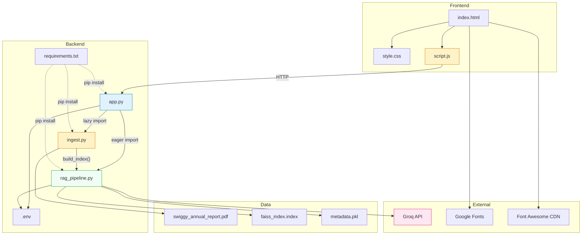

# SwiggyRAG — Codebase Reference

## Module 1: `backend/app.py` — API Gateway

**Purpose**: The FastAPI application entry point. Defines all HTTP endpoints, request/response models, CORS configuration, and the similarity threshold guard. This is the **only module that should be modified to add new endpoints**.

**Responsibilities**:
- Define REST API routes (`/ask`, `/rebuild-index`)
- Validate incoming requests via Pydantic models
- Apply the hallucination guard (similarity threshold check)
- Orchestrate calls between `ingest.py` and `rag_pipeline.py`
- Configure CORS middleware

### Key Exports & Symbols

| Symbol | Type | Line | Description |
|---|---|---|---|
| `app` | `FastAPI` instance | 10 | The ASGI application object; used by uvicorn |
| `QuestionRequest` | Pydantic `BaseModel` | 20-21 | Request body schema: `{ question: str }` |
| `Source` | Pydantic `BaseModel` | 23-26 | Individual source citation: `{ page: int, content: str, score: float }` |
| `AnswerResponse` | Pydantic `BaseModel` | 28-30 | Full response schema: `{ answer: str, sources: list[Source] }` |
| `SIMILARITY_THRESHOLD` | `float` constant | 34 | `1.5` — L2 distance cutoff for hallucination prevention |
| `ask_question()` | Route handler | 36-63 | `POST /ask` — retrieves chunks, checks threshold, generates answer |
| `rebuild_index()` | Route handler | 65-81 | `POST /rebuild-index` — re-ingests PDF and rebuilds FAISS index |

### Endpoint Specifications

#### `POST /ask`

| Property | Value |
|---|---|
| **Path** | `/ask` |
| **Method** | POST |
| **Request Body** | `{ "question": "string" }` |
| **Response (success)** | `{ "answer": "string", "sources": [{ "page": int, "content": "string", "score": float }] }` |
| **Response (low confidence)** | `{ "answer": "Insufficient information found in the Swiggy Annual Report.", "sources": [] }` |
| **Response (error)** | HTTP 500 `{ "detail": "error message" }` |
| **Authentication** | None |
| **Validation** | Pydantic validates `question` is a non-missing string |

**Business Logic**:
1. Resolves file paths for FAISS index and metadata relative to `__file__`
2. Calls `retrieve(question, top_k=5)` to get top-5 nearest chunks
3. **Guard clause**: If `chunks` is empty OR `chunks[0]['score'] > 1.5`, returns the safe "insufficient information" response with no sources
4. Otherwise, calls `generate_answer(question, chunks)` to get the LLM response
5. Maps chunks to `Source` Pydantic models and returns the full `AnswerResponse`

#### `POST /rebuild-index`

| Property | Value |
|---|---|
| **Path** | `/rebuild-index` |
| **Method** | POST |
| **Request Body** | None |
| **Response (success)** | `{ "status": "success", "message": "Successfully built index with N chunks." }` |
| **Response (no PDF)** | HTTP 404 `{ "detail": "PDF file not found in data directory." }` |
| **Response (error)** | HTTP 500 `{ "detail": "error message" }` |

**Business Logic**:
1. Lazy imports `ingest.process_pdf` and `rag_pipeline.build_index`
2. Resolves `pdf_path` to `backend/data/swiggy_annual_report.pdf`
3. Calls `process_pdf(pdf_path)` to extract and chunk the PDF
4. If no chunks (file missing or empty), returns HTTP 404
5. Calls `build_index(chunks, index_path, meta_path)` to embed and persist
6. Returns success with chunk count

### Dependencies

| Depends On | For |
|---|---|
| `rag_pipeline.retrieve` | Vector search (eager import) |
| `rag_pipeline.generate_answer` | LLM generation (eager import) |
| `ingest.process_pdf` | PDF parsing (lazy import in `/rebuild-index`) |
| `rag_pipeline.build_index` | Index construction (lazy import in `/rebuild-index`) |
| `fastapi` | Framework |
| `pydantic` | Models |
| `python-dotenv` | `.env` loading |

### Used By

- Frontend `script.js` (via HTTP)
- `uvicorn` CLI (as ASGI app reference `app:app`)

### Side Effects

- `load_dotenv(override=True)` at module load modifies `os.environ`
- Importing `rag_pipeline` at module level triggers `SentenceTransformer` model initialization

### Modification Risks

| Change | Risk |
|---|---|
| Adding new endpoints | 🟢 Low — standard FastAPI pattern |
| Changing `SIMILARITY_THRESHOLD` | 🟡 Medium — affects answer quality vs. coverage trade-off |
| Changing response models | 🔴 High — breaks frontend contract |
| Adding authentication middleware | 🟡 Medium — requires frontend changes to send tokens |

---

## Module 2: `backend/ingest.py` — Document Processor

**Purpose**: Reads a PDF file, extracts text page-by-page, normalizes whitespace, and splits into overlapping chunks suitable for embedding. This module is **pure document processing** with no AI/ML dependencies.

**Responsibilities**:
- PDF text extraction
- Text cleaning (whitespace normalization)
- Text chunking with configurable size and overlap
- Chunk metadata tagging (sequential ID, page number)

### Key Exports & Symbols

| Symbol | Type | Line | Description |
|---|---|---|---|
| `clean_text(text)` | Function | 6-9 | Collapses all whitespace sequences into single spaces, strips leading/trailing |
| `process_pdf(pdf_path)` | Function | 11-45 | Main entry point: reads PDF → extracts → cleans → chunks → returns list of dicts |

### Function Details

#### `clean_text(text: str) -> str`

- **Input**: Raw text string (potentially with tabs, newlines, multiple spaces)
- **Transformation**: `re.sub(r'\s+', ' ', text).strip()`
- **Output**: Single-spaced, trimmed string
- **Why**: PDF text extraction often produces erratic whitespace from layout parsing

#### `process_pdf(pdf_path: str) -> list[dict]`

- **Input**: Absolute path to a PDF file
- **Output**: List of `{ chunk_id: int, page: int, content: str }` dicts
- **Returns `[]`** if file doesn't exist (prints warning, does not raise)
- **Chunking configuration** (hardcoded at lines 20-24):
  - `chunk_size=800` characters
  - `chunk_overlap=150` characters
  - `length_function=len` (character-based, not token-based)
  - Splitter: `RecursiveCharacterTextSplitter` — tries to split on `\n\n`, `\n`, ` `, then character boundary
- **Page numbering**: 1-indexed (adds 1 to `enumerate` index)

### Chunk Schema

```python
{
    "chunk_id": 0,       # Sequential integer starting from 0
    "page": 1,           # 1-indexed PDF page number
    "content": "..."     # Cleaned text, ≤ 800 characters
}
```

### Dependencies

| Depends On | For |
|---|---|
| `pypdf.PdfReader` | PDF text extraction |
| `langchain.text_splitter.RecursiveCharacterTextSplitter` | Intelligent text chunking |
| `re` (stdlib) | Whitespace normalization |
| `os` (stdlib) | Path existence check, `__main__` path resolution |

### Used By

| Consumer | How |
|---|---|
| `app.py` → `rebuild_index()` | Lazy import, called to process PDF during index rebuild |
| Direct execution (`__main__`) | Can be run standalone to test PDF processing |

### Business Logic

The chunking strategy is the core business logic:
- **800 characters** was chosen as a balance between providing enough context for meaningful retrieval and keeping chunks small enough for precise similarity matching
- **150 characters of overlap** ensures that sentences or ideas that span chunk boundaries are captured in at least one chunk
- **Recursive splitting** prefers to break at paragraph boundaries (`\n\n`), then sentence boundaries (`\n`), then word boundaries (` `), minimizing mid-word splits

### Side Effects

- Prints to stdout: `"Processing PDF: ..."`, `"PDF file not found!"`, `"Total chunks generated: N"`
- No file writes

### Modification Guidelines

| Change | How | Risk |
|---|---|---|
| Change chunk size | Edit line 21: `chunk_size=800` | 🟡 **Must rebuild index** — larger chunks reduce precision, smaller chunks lose context |
| Change overlap | Edit line 22: `chunk_overlap=150` | 🟡 **Must rebuild index** |
| Add metadata fields | Extend the dict at line 37-41 | 🟢 Low — but update `metadata.pkl` consumers |
| Support multiple PDFs | Loop over files in a directory | 🟡 Medium — add `filename` field to chunk metadata |
| Support non-PDF formats | Add new extraction function | 🟢 Low — isolated module |

---

## Module 3: `backend/rag_pipeline.py` — RAG Core

**Purpose**: The central intelligence module. Handles embedding generation, FAISS index management, vector search, and LLM answer generation. This is the **most complex module** and the one with the most external dependencies.

**Responsibilities**:
- Load and manage the `SentenceTransformer` embedding model
- Build FAISS vector indexes from chunk embeddings
- Serialize/deserialize indexes and metadata to/from disk
- Perform nearest-neighbor search on FAISS indexes
- Construct grounded prompts and call the Groq LLM API

### Key Exports & Symbols

| Symbol | Type | Line | Description |
|---|---|---|---|
| `EMBEDDING_MODEL` | `str` constant | 8 | `'all-MiniLM-L6-v2'` — HuggingFace model identifier |
| `INDEX_FILE` | `str` constant | 9 | `'faiss_index.index'` — default index filename |
| `METADATA_FILE` | `str` constant | 10 | `'metadata.pkl'` — default metadata filename |
| `embedder` | `SentenceTransformer` instance | 13 | **Module-level global** — loaded at import time |
| `build_index(chunks, index_path, meta_path)` | Function | 15-35 | Embed chunks → create FAISS index → write to disk |
| `load_index(index_path, meta_path)` | Function | 37-46 | Read FAISS index + metadata from disk |
| `retrieve(query, top_k, index_path, meta_path)` | Function | 48-63 | Embed query → search FAISS → return scored chunks |
| `generate_answer(query, contexts)` | Function | 65-98 | Build prompt → call Groq API → return answer text |

### Function Details

#### `build_index(chunks, index_path=None, meta_path=None) -> (index, metadata)`

1. Extracts `content` from each chunk dict
2. Calls `embedder.encode(texts, show_progress_bar=True)` — produces `[N × 384]` float32 array
3. Creates metadata dict: `{ 0: chunk_0, 1: chunk_1, ... }`
4. Creates `faiss.IndexFlatL2(384)` and adds all embeddings
5. Writes index to disk with `faiss.write_index()`
6. Pickles metadata dict to disk
7. Returns `(index, metadata)` tuple

#### `load_index(index_path=None, meta_path=None) -> (index, metadata) | (None, None)`

1. Checks if both files exist; returns `(None, None)` if either is missing
2. Reads FAISS index with `faiss.read_index()`
3. Unpickles metadata with `pickle.load()`
4. Returns `(index, metadata)` tuple

**⚠️ Security Note**: `pickle.load()` deserializes arbitrary Python objects. If `metadata.pkl` is replaced with a malicious file, it could execute arbitrary code.

#### `retrieve(query, top_k=5, index_path=None, meta_path=None) -> list[dict]`

1. Loads index and metadata via `load_index()`
2. Raises `ValueError` if index doesn't exist
3. Encodes query string: `embedder.encode([query]).astype('float32')` → `[1 × 384]`
4. Searches: `index.search(query_embedding, top_k)` → `distances[1][top_k]`, `indices[1][top_k]`
5. For each valid result (`idx != -1`):
   - Copies chunk dict from metadata
   - Adds `score` field (L2 distance as float)
6. Returns list of scored chunk dicts, ordered by ascending L2 distance (best first)

**Return Schema**:
```python
[
    { "chunk_id": 0, "page": 1, "content": "...", "score": 0.42 },
    { "chunk_id": 3, "page": 2, "content": "...", "score": 0.67 },
    ...
]
```

#### `generate_answer(query, contexts) -> str`

1. Constructs prompt from template:
   ```
   You are a financial analyst assistant.
   Answer the question ONLY using the provided context.
   If the answer is not found in the context, respond:
   "The answer is not available in the Swiggy Annual Report."

   Context:
   Page 1:
   [chunk text]

   Page 2:
   [chunk text]

   Question:
   [user question]

   Answer:
   ```
2. Creates `Groq` client with API key from environment
3. Calls `client.chat.completions.create()` with:
   - Model: `os.getenv("GROQ_MODEL", "llama-3.1-8b-instant")`
   - Temperature: `0` (deterministic)
   - Max tokens: `500`
   - Single user message containing the full prompt
4. Returns the generated text
5. On any exception, returns error string (does **not** raise)

**Design Decision**: The function catches all exceptions and returns an error string rather than raising. This means the `/ask` endpoint will return a 200 with an error message as the "answer", not a 500 error. This is arguably a **bug** — the caller cannot distinguish success from failure via HTTP status code alone.

### Dependencies

| Depends On | For |
|---|---|
| `sentence_transformers.SentenceTransformer` | Text embedding (384-dim vectors) |
| `faiss` (`faiss-cpu`) | Vector index creation, serialization, search |
| `numpy` | Array type conversion (`astype('float32')`) |
| `pickle` (stdlib) | Metadata serialization |
| `groq.Groq` | LLM API client (lazy import inside `generate_answer`) |
| `os` (stdlib) | Environment variable access, file existence checks |

### Used By

| Consumer | Functions Used |
|---|---|
| `app.py` → `ask_question()` | `retrieve()`, `generate_answer()` |
| `app.py` → `rebuild_index()` | `build_index()` |

### Side Effects

- **At import time**: Instantiates `SentenceTransformer('all-MiniLM-L6-v2')` which:
  - Downloads ~90 MB model from HuggingFace on first run
  - Loads model into RAM (~200 MB)
  - Takes 2-5 seconds
- `build_index()` writes two files to disk
- `generate_answer()` makes an outbound HTTPS request to `api.groq.com`
- Prints to stdout during `build_index()`

### Modification Risks

| Change | Risk |
|---|---|
| Change `EMBEDDING_MODEL` | 🔴 **Critical** — Must rebuild index; dimension may change; all existing indexes become incompatible |
| Change prompt template | 🟡 Medium — Affects answer quality; test thoroughly |
| Change `temperature` | 🟢 Low — Higher values = more creative, less deterministic |
| Change `max_tokens` | 🟢 Low — Increase for longer answers |
| Switch to different LLM provider | 🟡 Medium — Replace Groq SDK call; keep same prompt structure |
| Add caching to `retrieve()` | 🟢 Low — Cache by query hash |
| Make `generate_answer()` async | 🟡 Medium — Would require async Groq client |

---

## Module 4: `frontend/index.html` — Page Shell

**Purpose**: The single HTML page that defines the application structure. Contains no logic — all behavior is in `script.js`.

**Responsibilities**:
- Define the page structure and semantic HTML
- Load external resources (Google Fonts, Font Awesome)
- Provide DOM elements with IDs for JavaScript to bind to

### Structure Map

```
<body>
  └── .container
      ├── <header>
      │   ├── .logo (icon)
      │   ├── <h1> (title)
      │   ├── .subtitle (description)
      │   └── .badge ("RAG-Powered | Source-Grounded Answers")
      │
      ├── <main>
      │   ├── .search-container.card-shadow
      │   │   ├── .input-wrapper
      │   │   │   ├── .search-icon
      │   │   │   ├── #question-input
      │   │   │   └── #submit-btn
      │   │   └── .quick-prompts
      │   │       └── .prompt-btn × 5
      │   │
      │   ├── #loading.hidden
      │   │   ├── .loading-animation (.dot × 3)
      │   │   └── #loading-status
      │   │
      │   └── #results-container.hidden
      │       ├── .answer-card.card-shadow
      │       │   ├── .answer-header (h3)
      │       │   ├── #answer-text
      │       │   └── #sources-summary.hidden
      │       │
      │       └── .context-card.card-shadow
      │           ├── #toggle-context
      │           └── #context-content.hidden
      │
      └── <footer>
          ├── .tech-stack
          └── .admin-controls
              └── #rebuild-btn

  └── #toast.hidden (fixed position overlay)
```

### External Resources

| Resource | URL | Purpose |
|---|---|---|
| Inter font | `fonts.googleapis.com` | Primary typeface (weights 300-800) |
| Font Awesome 6 | `cdnjs.cloudflare.com` | Icons (search, file, sync, chevron, sparkles, etc.) |

### Suggested Questions (Hardcoded)

| # | Question (`data-query` attribute) |
|---|---|
| 1 | "What were Swiggy's key revenue drivers?" |
| 2 | "Tell me about the corporate entity structure" |
| 3 | "Tell me about history of Swiggy" |
| 4 | "Give a Business Overview of Swiggy" |
| 5 | "What is Share Capital and Debt Structure of Swiggy?" |

### Modification Guidelines

| Change | How | Risk |
|---|---|---|
| Add suggested questions | Add `<button class="prompt-btn" data-query="...">` inside `.quick-prompts` | 🟢 Low |
| Change page title | Edit `<title>` tag (line 7) and `<h1>` (line 20) | 🟢 Low |
| Add new sections | Add HTML inside `<main>` | 🟢 Low — ensure IDs don't conflict |
| Change layout structure | Modify `.container` children | 🟡 Medium — may break CSS |

---

## Module 5: `frontend/script.js` — Client Controller

**Purpose**: All client-side JavaScript logic. Handles user interactions, API communication, and DOM manipulation. Uses the Fetch API for HTTP requests.

**Responsibilities**:
- Capture user input (click, keypress, suggested questions)
- Call backend API endpoints
- Render answer text, source citation bars, and context chunks
- Manage loading/error states
- Convert L2 scores to human-readable relevance percentages
- Handle index rebuild workflow

### Key Symbols

| Symbol | Type | Line | Description |
|---|---|---|---|
| `API_BASE_URL` | `const string` | 1 | `'http://localhost:8000'` — hardcoded backend URL |
| `showToast(message, duration)` | Function | 17-23 | Displays a transient notification for `duration` ms (default 3000) |
| `calculateRelevancePercentage(l2Score)` | Function | 26-32 | Converts FAISS L2 distance to 0-100% relevance |
| `askQuestion(question)` | Async function | 34-139 | Main flow: validate → show loading → POST /ask → render results |
| Event listeners | Various | 141-181 | Submit button click, Enter key, prompt buttons, context toggle, rebuild button |

### Function Details

#### `calculateRelevancePercentage(l2Score) -> number`

```
percent = 100 - (l2Score * 66.6)
clamped to [0, 100]
rounded to integer
```

- L2 = 0.0 → 100% (perfect match)
- L2 = 0.75 → 50%
- L2 = 1.5 → ~0% (threshold boundary)

This is an **approximate linear mapping** that inversely maps L2 distance to a percentage. The multiplier `66.6` is derived from `100 / 1.5` (the similarity threshold).

#### `askQuestion(question)` — Main UI Flow

1. **Validate**: Return early if question is empty/whitespace
2. **Reset UI**: Hide results, show loading, hide context, reset sources
3. **Update loading text**: "Retrieving relevant sections..."
4. **Disable button**: Change to spinner icon + "Analyzing..."
5. **Set timer** (1200ms): Change loading text to "Generating answer from context..."
6. **Fetch**: `POST /ask` with `{ question }` body
7. **On success**:
   - Set answer text content
   - If sources exist:
     - Build source summary HTML (page pills + relevance bars, deduplicated by page)
     - Build context HTML (raw chunk text cards)
     - Color-code relevance: ≥50% green, 20-49% amber, <20% red
   - If no sources: show "No supporting context" message
   - Show results, hide loading
8. **On error**: Show toast "Make sure the backend is running", hide loading
9. **Finally**: Re-enable button, restore original icon

#### Event Listeners

| Event | Element | Action |
|---|---|---|
| `click` | `#submit-btn` | Call `askQuestion(input.value)` |
| `keypress` (Enter) | `#question-input` | Call `askQuestion(input.value)` |
| `click` | `.prompt-btn` (each) | Set input value to `data-query`, call `askQuestion()` |
| `click` | `#toggle-context` | Toggle `.hidden` on context, toggle `.active` on button |
| `click` | `#rebuild-btn` | POST `/rebuild-index`, show success/error toast |

### Dependencies

| Depends On | For |
|---|---|
| Backend API at `http://localhost:8000` | `/ask` and `/rebuild-index` endpoints |
| Font Awesome CSS (loaded in HTML) | Icon classes (`fa-search`, `fa-spinner`, etc.) |
| DOM elements from `index.html` | All `getElementById`/`querySelectorAll` calls |

### Used By

- Loaded by `index.html` via `<script src="script.js">`

### Side Effects

- Modifies DOM (innerHTML, textContent, classList, style.display)
- Makes outbound HTTP requests to localhost:8000

### Modification Risks

| Change | Risk |
|---|---|
| Change `API_BASE_URL` | 🟢 Low — single constant |
| Add new DOM elements | 🟢 Low — add corresponding `getElementById` |
| Change response rendering | 🟡 Medium — innerHTML injection; ensure XSS safety |
| Add state management | 🟡 Medium — no existing pattern; would need architecture decision |
| Switch to framework (React, etc.) | 🔴 High — complete rewrite |

---

## Module 6: `frontend/style.css` — Design System

**Purpose**: The complete visual design system for the application. Uses CSS custom properties for theming and follows a component-based class naming convention.

**Responsibilities**:
- Define design tokens (colors, shadows, radii, typography)
- Style all UI components
- Provide animations (loading dots, fade-in, chevron rotation, spinner)
- Handle responsive layout via flexbox

### Design Token Reference (`:root`)

| Token | Value | Usage |
|---|---|---|
| `--primary-color` | `#fc8019` | Swiggy orange — primary accent |
| `--primary-dark` | `#d6640c` | Hover states |
| `--primary-light` | `#fff2e8` | Light backgrounds, focus rings |
| `--bg-gradient` | `linear-gradient(135deg, #f9fafb 0%, #f3f4f6 100%)` | Page background |
| `--surface-color` | `#ffffff` | Card backgrounds |
| `--border-color` | `#e5e7eb` | Borders, dividers |
| `--text-primary` | `#111827` | Main text |
| `--text-secondary` | `#6b7280` | Secondary text, labels |
| `--text-muted` | `#9ca3af` | Placeholder text, captions |
| `--shadow-sm/md/lg` | Box shadow values | Elevation levels |
| `--radius-md/lg/full` | `8px` / `12px` / `9999px` | Border radii |
| `--success-color` | `#10b981` | High-relevance score bars |

### Component Styles

| Component | CSS Selector(s) | Lines | Description |
|---|---|---|---|
| Reset | `*` | 1-5 | Box-sizing border-box, zero margins/padding |
| Body | `body` | 27-35 | Inter font, gradient background, centered flex |
| Container | `.container` | 37-44 | Max-width 850px, vertical flex layout |
| Card base | `.card-shadow` | 46-51 | White background, rounded corners, shadow |
| Header | `header`, `.logo`, `h1`, `.subtitle`, `.badge` | 53-97 | Centered header with icon, title, badge |
| Search | `.search-container`, `.input-wrapper`, `#question-input`, `#submit-btn` | 99-163 | Search bar with inline submit button |
| Quick Prompts | `.quick-prompts`, `.prompt-btn` | 165-197 | Pill-shaped suggestion buttons |
| Loading | `#loading`, `.loading-animation`, `.dot` | 199-248 | Three bouncing dots + status text |
| Results | `#results-container`, `.answer-card`, `#answer-text` | 250-297 | Answer card with fade-in animation |
| Sources | `.sources-list`, `.summary-source-item`, `.page-pill`, `.score-bar-*` | 299-361 | Page pills with horizontal relevance bars |
| Context | `.context-card`, `.toggle-btn`, `#context-content`, `.source-item` | 363-436 | Expandable context viewer with left-border accent |
| Footer | `footer`, `.tech-stack`, `.admin-controls`, `.settings-btn` | 438-483 | Centered footer with rebuild button |
| Toast | `.toast` | 485-500 | Fixed-position notification bar |
| Utility | `.hidden` | 502-504 | `display: none !important` |

### Animations

| Animation | Keyframes | Duration | Used On |
|---|---|---|---|
| `bounce` | Scale 0→1→0 with opacity | 1.4s infinite | Loading dots (`.dot`) |
| `fadeIn` | Translate Y 15px→0 + opacity | 0.5s cubic-bezier | Results container |
| `fa-spin` (overridden) | 360° rotation | 0.8s infinite | Submit button spinner |
| CSS transitions | Various | 0.2-0.3s | Hover states on buttons, input focus, chevron rotation |

### Modification Guidelines

| Change | How | Risk |
|---|---|---|
| Change brand colors | Update `--primary-*` in `:root` | 🟢 Low — propagates everywhere |
| Add dark mode | Add `[data-theme="dark"]` `:root` overrides | 🟡 Medium |
| Add responsive breakpoints | Add `@media` queries | 🟡 Medium — no existing breakpoints |
| Change typography | Update `font-family` in `body` | 🟢 Low |

---

## Module 7: `generate_pdf.py` — Test Data Generator

**Purpose**: A standalone utility script that generates a minimal 2-page synthetic Swiggy Annual Report PDF for testing and demo purposes.

**Responsibilities**:
- Create a simple PDF with sample financial and operational text
- Write to `backend/data/swiggy_annual_report.pdf`

### Key Details

| Property | Value |
|---|---|
| Library | `fpdf` (FPDF class) |
| Output | `e:/OM Professional/Projects/SwiggyRAG/backend/data/swiggy_annual_report.pdf` |
| Pages | 2 |
| Font | Arial, size 12 |
| Content | Page 1: Revenue (4653.30 crores FY23), EBITDA, marketing spend. Page 2: Instamart, risk factors, delivery partner attrition |

### Content Summary

| Page | Topics Covered |
|---|---|
| 1 | Revenue from operations (4653.30 crores FY23), negative EBITDA/PAT, marketing spend impact |
| 2 | Instamart performance, dark store economics, competitive quick-commerce, regulatory risks, gig economy, delivery partner attrition |

### Dependencies

| Depends On | For |
|---|---|
| `fpdf` | PDF generation |

> **Note**: `fpdf` is **not** listed in `requirements.txt`. This script requires a separate `pip install fpdf` to run.

### Used By

- Run manually by developer before first backend start
- Not imported by any other module

### Modification Guidelines

| Change | How | Risk |
|---|---|---|
| Add more pages | Add `pdf.add_page()` + `pdf.multi_cell()` calls | 🟢 Low |
| Change output path | Edit line 14 | 🟢 Low |
| Add tables/formatting | Use FPDF table methods | 🟡 Medium — FPDF has limited table support |

---

## Module 8: `backend/.env` / `.env.example` — Configuration

**Purpose**: Environment variable configuration for the backend.

### `.env.example` (Template)

```
LLM_PROVIDER=groq
GROQ_API_KEY=your_evaluator_api_key_goes_here
```

### `.env` (Actual)

```
LLM_PROVIDER=groq
GROQ_API_KEY=your_groq_api_key_goes_here
```

### Variable Usage

| Variable | Read By | Line | How |
|---|---|---|---|
| `GROQ_API_KEY` | `rag_pipeline.py` | 86 | `os.getenv("GROQ_API_KEY")` → passed to `Groq(api_key=...)` |
| `GROQ_MODEL` | `rag_pipeline.py` | 91 | `os.getenv("GROQ_MODEL", "llama-3.1-8b-instant")` — optional with default |
| `LLM_PROVIDER` | **NONE** | — | Defined but never read by any code |

---

## Module 9: `backend/requirements.txt` — Dependency Manifest

```
fastapi          # Web framework
uvicorn          # ASGI server
python-multipart # UNUSED — no file upload endpoints
pypdf            # PDF text extraction
sentence-transformers  # Text embedding model
faiss-cpu        # Vector similarity search
langchain        # Text splitter utility
langchain-community    # Required by langchain
openai           # UNUSED — never imported
tqdm             # Progress bars (transitive dependency, explicitly listed)
python-dotenv    # .env file loading
groq             # Groq LLM API client
```

### Issues

- **No version pins**: All packages are unpinned. A `pip install -r requirements.txt` at different times may produce different environments.
- **Dead dependencies**: `openai` and `python-multipart` are listed but never used.
- `fpdf` (used by `generate_pdf.py`) is **not** listed.

---

## Module 10: `.gitignore` — Version Control Configuration

### Ignored Patterns

| Pattern | Purpose |
|---|---|
| `.env` | Secrets file |
| `venv/`, `env/`, `ENV/`, `env.bak/`, `venv.bak/` | Python virtual environments |
| `__pycache__/`, `*.py[cod]`, `*$py.class` | Python bytecode |
| `.vscode/`, `.idea/` | IDE configuration |

### Notable: FAISS Files NOT Ignored

Lines 14-16 show commented-out ignore rules for `faiss_index.index` and `metadata.pkl`. These files **are** committed to the repository, which means the pre-built index is version-controlled. This is intentional for demo purposes but would be inappropriate for production.

---

## File Index

| # | File | Lines | Bytes | Language | Module |
|---|---|---|---|---|---|
| 1 | `backend/app.py` | 86 | 2,833 | Python | API Gateway |
| 2 | `backend/ingest.py` | 52 | 1,454 | Python | Document Processor |
| 3 | `backend/rag_pipeline.py` | 99 | 3,232 | Python | RAG Core |
| 4 | `backend/requirements.txt` | 13 | 144 | Text | Dependency Manifest |
| 5 | `backend/.env` | 3 | 90 | Env | Secrets |
| 6 | `backend/.env.example` | 3 | 66 | Env | Config Template |
| 7 | `backend/faiss_index.index` | — | 136,749 | Binary | FAISS Vector Index |
| 8 | `backend/metadata.pkl` | — | 60,458 | Binary | Chunk Metadata |
| 9 | `backend/data/swiggy_annual_report.pdf` | — | 13,471,481 | Binary | Source Document |
| 10 | `frontend/index.html` | 97 | 4,411 | HTML | Page Shell |
| 11 | `frontend/script.js` | 182 | 7,647 | JavaScript | Client Controller |
| 12 | `frontend/style.css` | 504 | 10,488 | CSS | Design System |
| 13 | `generate_pdf.py` | 16 | 911 | Python | Test Data Generator |
| 14 | `README.md` | 85 | 3,478 | Markdown | Documentation |
| 15 | `.gitignore` | 21 | 309 | Config | VCS Configuration |

**Total**: 15 files, ~1,143 lines of source code, ~13.7 MB total (dominated by the PDF).

---

## Dependency Graph (Cross-Module)



---

## Modification Impact Guide

### Safe Areas (Low Risk)

| Area | Why Safe |
|---|---|
| Adding new suggested questions in `index.html` | Isolated HTML; JS auto-binds via `.prompt-btn` class |
| Changing CSS custom properties in `:root` | Propagates cleanly; no hardcoded colors elsewhere (mostly) |
| Changing `API_BASE_URL` in `script.js` | Single constant, no other references |
| Adding new API endpoints in `app.py` | FastAPI is additive; existing routes unaffected |
| Changing `max_tokens` or `temperature` in `rag_pipeline.py` | Only affects LLM output quality |
| Editing the prompt template in `generate_answer()` | Only affects answer generation behavior |

### High-Risk Areas

| Area | Why Risky | What Breaks |
|---|---|---|
| Changing `EMBEDDING_MODEL` in `rag_pipeline.py` | Changes vector dimensionality | **All existing FAISS indexes become incompatible**; must rebuild |
| Changing `AnswerResponse` or `Source` Pydantic models | Breaks API contract | Frontend rendering fails |
| Changing chunk size/overlap in `ingest.py` | Changes what gets embedded | Existing index becomes semantically stale; must rebuild |
| Removing/renaming DOM IDs in `index.html` | JavaScript binds by ID | `getElementById` returns null → runtime errors |
| Changing `SIMILARITY_THRESHOLD` | Affects hallucination guard sensitivity | Too low: refuses valid answers. Too high: allows hallucinations |

---

## Testing Notes

### Current State

**There are zero tests.** No unit tests, no integration tests, no end-to-end tests, no test framework configuration.

### Recommended Test Strategy

| Layer | Framework | What to Test |
|---|---|---|
| Backend unit | `pytest` | `clean_text()`, `calculateRelevancePercentage()` logic, threshold guard |
| Backend integration | `pytest` + `httpx` (TestClient) | `/ask` and `/rebuild-index` endpoint responses |
| RAG pipeline | `pytest` with mocks | `retrieve()` with a pre-built small index; `generate_answer()` with mocked Groq |
| Frontend | `jest` + `jsdom` or Playwright | DOM rendering, API mocking, user interaction flows |

### Manual Testing Checklist

1. Start backend (`uvicorn app:app ...`)
2. Start frontend (`python -m http.server 8080`)
3. Click "Refresh Knowledge Base" → verify toast shows success
4. Ask a sample question → verify answer + sources appear
5. Click "View Supporting Context" → verify chunks expand
6. Ask an irrelevant question → verify "Insufficient information" response
7. Stop backend → ask a question → verify error toast appears

---

## Common Mistakes

| Mistake | Consequence | Prevention |
|---|---|---|
| Changing embedding model without rebuilding index | FAISS search returns garbage or crashes on dimension mismatch | Always rebuild index after changing `EMBEDDING_MODEL` |
| Forgetting to set `GROQ_API_KEY` in `.env` | `generate_answer()` returns "Error connecting to Groq API: ..." | Check `.env` before starting backend |
| Modifying Pydantic response models without updating frontend | Frontend silently fails to render fields | Search `script.js` for all `data.` property accesses |
| Adding `async` to endpoint without awaiting | Returns coroutine object instead of response | Use `async def` + `await` consistently |
| Editing `metadata.pkl` schema without rebuilding | `retrieve()` returns chunks with missing/extra fields | Always rebuild index after changing chunk metadata structure |
| Running `pip install` without a venv | Pollutes global Python environment | Always activate venv first |
| Using `innerHTML` with untrusted content | XSS vulnerability if PDF contains HTML | Sanitize or use `textContent` instead |
